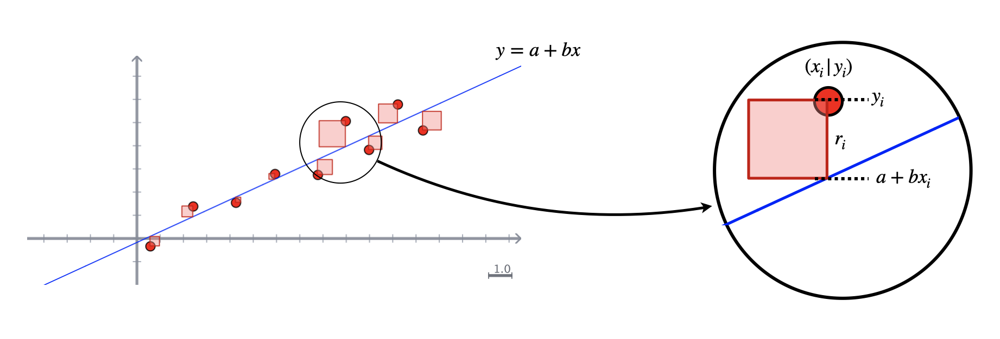

**CC-BY-SA**. Dieses Material steht unter der Creative-Commons-Lizenz »Namensnennung - Weitergabe unter gleichen Bedingungen 4.0 International (CC BY-SA 4.0)« -- siehe https://creativecommons.org/licenses/by-sa/4.0/deed.de

## Idee

Gegeben sind $n$ Punkte mit den Koordinaten $(x_i|y_i)$, die in ein Koordinatensystem eingetragen werden. 

Ziel ist es nun, sofern ein annähernd linearer Zusammenhang vermutet wird, die **bestmögliche Gerade** zu finden, die die Lage der Punkte beschreibt.

Doch was heißt hier *bestmöglich*? Für jeden Punkt kann die Abweichung $r_i$ von der Gerade beschrieben werden über $$\begin{align*}r_i &= f(x_i) - y_i \\ &= a+bx_i-y_i\end{align*}$$

Nun könnte man die Summer über alle $|r_i|$ bilden und versuchen, die Gerade zu finden, die diese Summe minimiert. Möchte man jedoch für das Minimalproblem Methoden der Differenzialrechnung nutzen, stört der Betrag, denn dieser ist nicht differenzierbar. Dies kann man umgehen, indem man die Abweichungen einfach quadriert und dann minimiert.

**Es wird also die Gerade $y = a+bx$ gesucht, so dass $\sum r_i^2$ minimal wird.** Daher wird diese Methode auch als die der kleinsten Quadrate bezeichnet.
Im folgenden gilt immer $i\in\{1,2,\dots,n\}$, so dass auch bei Summenzeichen die Indizes weggelassen werden, d. h. $\sum\limits_{i=1}^n r_i$ erhält die Kurzsschreibweise $\sum r_i$.

## Analysis hilft

Nun gilt:

$$\begin{align*}\sum r_i^2 &= \sum (a+bx_i-y_i)^2\end{align*}$$
Dabei sind die $x_i$ und $y_i$ feste Werte (die sich aus den Punkten ergeben), man muss also nach $a$ und $b$ ableiten sowie Null setzen, um die Minima zu finden. 

Aufgefasst als Funktion von $a$, abgleitet und Null gesetzt, erhält man:

$$\begin{align*} \sum 2(a+bx_i-y_i) &= 0\\&\Leftrightarrow\\ \sum a + \sum bx_i &= \sum y_i \\&\Leftrightarrow\\ na + b\sum x_i &= \sum y_i\end{align*}$$

Aufgefasst als Funktion von $b$, abgleitet und Null gesetzt, erhält man:
$$\begin{align*} \sum \left(2(a+bx_i-y_i)\cdot x_i\right) &= 0\\&\Leftrightarrow\\ a\sum x_i + b\sum x_i^2 &= \sum x_iy_i \end{align*}$$
Wir haben also zwei Gleichungen, in denen jeweils $a$ und $b$ linear vorkommen, zu lösen:

$$\left|\begin{align*} na + b\sum x_i &= \sum y_i \\ a\sum x_i + b\sum x_i^2 &= \sum x_iy_i \end{align*}\right|$$
Streng genommen hat man dann jedoch erst die *notwendige Bedingung* erfüllt, dass die Ableitung Null ist. Es fehlt noch eine *hinreichende Bedingung* dafür, dass es sich wirklich um ein Minimum handelt. Darauf soll hier erst einmal vertraut werden -- aber Sie sollten kritisch genug sein, um das auch mal nachprüfen zu wollen.

## Lineare Algebra hilft

Die Lösung des Gleichungssystems lässt sich nun mithilfe der linearen Algebra geschickt und einfach durchführen. Dazu soll das, was im Gleichungssystem steht, noch ein wenig anders dargestellt werden. 

Zunächst soll das Gleichungssystem in die Form $\left(\begin{matrix}\cdot & \cdot \\ \cdot & \cdot \end{matrix}\right)\left(\begin{matrix}a  \\ b \end{matrix}\right) = \left(\begin{matrix}\cdot \\ \cdot \end{matrix}\right)$ gebracht werden. Dann gilt:

$$\left(\begin{matrix}n & \sum x_i \\ \sum x_i & \sum x_i^2 \end{matrix}\right)\left(\begin{matrix}a  \\ b \end{matrix}\right) = \left(\begin{matrix}\sum y_i \\ \sum x_iy_i \end{matrix}\right)$$
Dann soll die rechte Seite der Gleichung noch vereinfacht und idealerweise als Matrixprodukt dargestellt werden. Mit gutem Hingucken und ein bisschen Recherche ist eine Möglichkeit:

$$\left(\begin{matrix}n & \sum x_i \\ \sum x_i & \sum x_i^2 \end{matrix}\right)\left(\begin{matrix}a  \\ b \end{matrix}\right) = \left(\begin{matrix}1 & \cdots & 1 \\ x_1 & \cdots & x_n \end{matrix}\right)\left(\begin{matrix}y_1 \\ \vdots \\ y_n \end{matrix}\right)$$
Die beiden Hilfsmatrizen $\left(\begin{matrix}1 & \cdots & 1 \\ x_1 & \cdots & x_n \end{matrix}\right)$ und $\left(\begin{matrix}y_1 \\ \vdots \\ y_n \end{matrix}\right)$ beinhalten also nur die Koordinaten der Punkte und können daher schnell aus gegebenen Daten erzeugt werden. Aber noch besser: Auch die linke Seite der Gleichung lässt sich mit diesen Matrizen darstellen:

$$\left(\begin{matrix}1 & \cdots & 1 \\ x_1 & \cdots & x_n \end{matrix}\right)\left(\begin{matrix}1 & x_1 \\ \vdots & \vdots\\ 1 & x_n \end{matrix}\right)\left(\begin{matrix}a  \\ b \end{matrix}\right) = \left(\begin{matrix}1 & \cdots & 1 \\ x_1 & \cdots & x_n \end{matrix}\right)\left(\begin{matrix}y_1 \\ \vdots \\ y_n \end{matrix}\right)$$

Mit $\mathbf{M}:= \left(\begin{matrix}1 & x_1 \\ \vdots & \vdots\\ 1 & x_n \end{matrix}\right)$ und $\mathbf{y}:=\left(\begin{matrix}y_1 \\ \vdots \\ y_n \end{matrix}\right)$ sieht das also alles schon viel schicker aus: 

$$\mathbf{M}^T\mathbf{M}\left(\begin{matrix}a  \\ b \end{matrix}\right) = \mathbf{M}^T\mathbf{y}$$

Wenn man jetzt noch die inverse Matrix zu $\mathbf{M}^T\mathbf{M}$ findet (was nicht so schwer ist, da $\mathbf{M}\mathbf{M}\in\mathbb{R}^{2\times 2}$ ist), dann kann man damit von links multiplizieren und erhält:

$$\left(\begin{matrix}a  \\ b \end{matrix}\right) = (\mathbf{M}^T\mathbf{M})^{-1}\mathbf{M}^T\mathbf{y}$$
Dies ist also eine direkte Berechnungsvorschrift, um $a$ und $b$ und damit die Gerade $y = a+bx$ zu erhalten, wenn die Koordinaten der Punkte über $x_i$ und $y_i$ gegeben sind.

